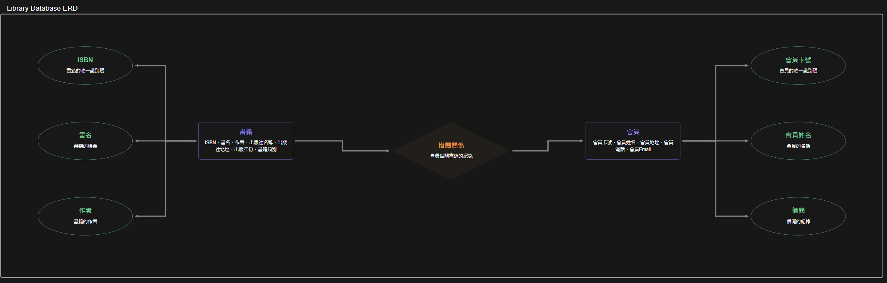

# Lab-05_1：圖書館資料庫設計
## 情境
請為圖書館設計資料庫。圖書館需要追蹤書籍、會員以及借閱記錄。

## 資料基本包含

- 書籍：ISBN、書名、作者 (可能多位)、出版社名稱、出版社地址、出版年份、書籍類別。
- 會員：會員卡號、會員姓名、會員地址、會員電話、會員Email。
- 借閱：會員卡號、會員姓名、ISBN、書名、借閱日期、應還日期、實際歸還日期。

## 任務
#### 1. 識別問題與函數相依性：
- 分析上述初步收集的資料，找出潛在的資料重複、插入異常、更新異常和刪除異常。
- 列出所有合理的函數相依性。

```
潛在的資料問題
資料重複：在書籍中，重複的書籍資料（例如相同ISBN的書籍），以及在會員資料中可能會重複的會員信息（例如，同一會員地址的不同登記）。插入異常：如果一位會員尚未借閱任何書籍，他們的資料就無法被插入借閱紀錄中。更新異常：如果書籍的出版社名稱或地址需要更改，可能需要在多個紀錄中進行更新，容易導致不一致性。刪除異常：刪除某個借閱紀錄時，也許會誤刪除該書籍或該會員的資料。

函數相依性列表
ISBN → 書名、作者、出版社名稱、出版社地址、出版年份、書籍類別會員卡號 → 會員姓名、會員地址、會員電話、會員Email會員卡號、ISBN → 借閱日期、應還日期、實際歸還日期
```

#### 2. 正規化設計
- 將資料庫綱要 (Schema) 正規化至第三正規化 (3NF)。如果可以，嘗試達到 BCNF。
- 繪製最終的實體關係圖 (ERD)。
```
正規化過程
第一正規化 (1NF)：去除重複資料，確保所有資料項都是原子值。將書籍的作者分開，以便每本書可以有多位作者。
第二正規化 (2NF)：確保每一個非主鍵屬性都完全依賴於主鍵。對於借閱資料，我們將會員資料與借閱紀錄分開，使用會員卡號作為關聯。
第三正規化 (3NF)：消除傳遞依賴。如果一個非主鍵屬性依賴於另一非主鍵屬性，則將其分離。例如，出版社地址依賴於出版社名稱，因此我們需要將出版社信息獨立化。

最終資料庫綱要
Books (書籍表)ISBN (主鍵)書名出版社名稱 (外鍵)出版年份書籍類別Publishers (出版社表)出版社名稱 (主鍵)出版社地址Members (會員表)會員卡號 (主鍵)會員姓名會員地址會員電話會員EmailBorrowings (借閱表)會員卡號 (外鍵)ISBN (外鍵)借閱日期應還日期實際歸還日期
```




