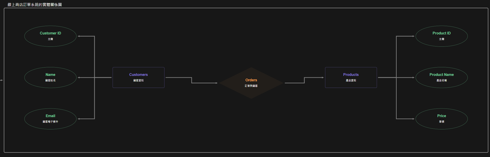

# Lab-05_2：線上商店訂單系統
## 情境
一家小型線上商店需要一個系統來管理顧客、產品和訂單。

## 初步收集的資料可能包含
- 顧客：顧客ID、顧客姓名、Email、電話號碼、完整送貨地址 (街道、城市、郵遞區號、國家)。
- 產品：產品ID、產品名稱、產品描述、單價、庫存數量、供應商名稱、供應商聯絡方式。
- 訂單：訂單ID、顧客ID、顧客姓名、訂單日期、訂單總金額、產品ID (多個)、產品名稱 (多個)、購買數量 (對應每個產品)、單價 (對應每個產品)。

##任務

#### 1. 分析與正規化
- 從一個包含所有訂單資訊的單一扁平化表格概念開始 (例如，一張包含所有上述欄位的試算表)。
- 找出函數相依性。
- 將綱要正規化至第三正規化 (3NF)。
```
首先，我們需要確定每一個資料項之間的功能相依性，以了解哪些欄位可以被移到不同的資料表中。
顧客：顧客ID → 顧客姓名、Email、電話號碼、送貨地址 (街道、城市、郵遞區號、國家)
產品：產品ID → 產品名稱、產品描述、單價、庫存數量、供應商名稱、供應商聯絡方式
訂單：訂單ID → 顧客ID、顧客姓名、訂單日期、訂單總金額訂單ID、產品ID → 購買數量、單價
因為訂單中顧客的名字和顧客ID是重複的，因此應該移至顧客表中，這樣可以減少冗餘。
```
#### 2. 分析與說明SSSSS
- 說明您的正規化步驟。
```
第一正規化（1NF）：將資料劃分為幾個表格，確保每個表格的資料都是原子性的且無重複欄位。
顧客表（Customers）顧客ID (主鍵)顧客姓名Email電話號碼街道城市郵遞區號國家產品表（Products）產品ID (主鍵)產品名稱產品描述單價庫存數量供應商名稱供應商聯絡方式訂單表（Orders）訂單ID (主鍵)顧客ID (外鍵)訂單日期訂單總金額訂單明細表（Order_Items）訂單明細ID (主鍵)訂單ID (外鍵)產品ID (外鍵)購買數量單價
第二正規化（2NF）確：所有非主鍵欄位依賴於整個主鍵，而不是主鍵的一部分。以上的表格已經滿足。
第三正規化（3NF）：確保所有非主鍵欄位不依賴於其他非主鍵欄位。
```


