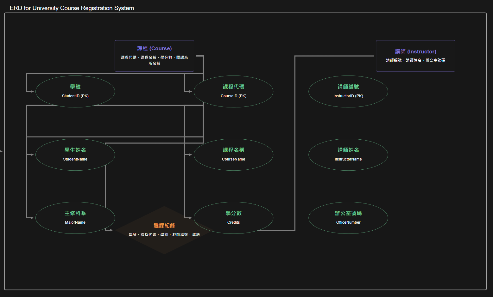

# Lab-05_3：大學課程註冊系統

## 情境
設計一個大學課程註冊系統的資料庫。系統需管理學生、課程、講師以及學生的選課記錄。

## 初步收集的資料可能包含

- 學生：學號、學生姓名、主修科系名稱、主修科系辦公室地點。
- 課程：課程代碼、課程名稱、學分數、開課系所代碼、開課系所名稱。
- 講師：講師編號、講師姓名、講師所屬系所代碼、講師所屬系所名稱、講師辦公室號碼。
- 選課記錄：學號、學生姓名、課程代碼、課程名稱、學期、授課講師編號、授課講師姓名、成績。

## 假設
一位講師可能教授多門課程，一門課程也可能由多位講師講授 (例如，不同班級或共同授課)。
學生選修特定學期的特定課程，由特定講師授課。

## 任務
#### 函數相依性分析   
- 學生資訊
- 1. 學號 → 學生姓名, 主修科系名稱, 主修科系辦公室地點
- 2. 學生姓名 → 學號 (假設姓名不會重複)

- 課程資訊
課程代碼 → 課程名稱, 學分數, 開課系所代碼, 開課系所名稱

- 講師資訊
講師編號 → 講師姓名, 講師所屬系所代碼, 講師所屬系所名稱, 講師辦公室號碼

- 選課記錄
(學號, 課程代碼, 學期, 授課講師編號) → 學生姓名, 課程名稱, 授課講師姓名, 成績

#### 正規化至 BCNF
- 將資料庫綱要正規化至 Boyce-Codd 正規化 (BCNF)。如果 BCNF 導致過多的分解或效能問題，可以退回至 3NF，並說明理由。
- 繪製最終的 ERD。

- 學生 (Student)
```
1. 學號 (StudentID)
2. 學生姓名 (StudentName)
3. 主修科系名稱 (MajorName)
4. 主修科系辦公室地點 (MajorOffice)
```

- 課程 (Course)
```
1. 課程代碼 (CourseID)
2. 課程名稱 (CourseName)
3. 學分數 (Credits)
4. 開課系所代碼 (DeptCode)
5. 開課系所名稱 (DeptName)
```

- 講師 (Instructor)
```
1. 講師編號 (InstructorID)
2. 講師姓名 (InstructorName)
3. 講師所屬系所代碼 (DeptCode)
4. 講師所屬系所名稱 (DeptName)
5. 講師辦公室號碼 (OfficeNumber)
```

- 選課紀錄 (Enrollment)
```
1. 學號 (StudentID)
2. 課程代碼 (CourseID)
3. 學期 (Semester)
4. 授課講師編號 (InstructorID)
5. 成績 (Grade)
```

- 步驟
```
學生表及其依賴性沒有任何複合鍵，因此保持不變。課程表及講師表也保持不變，因為所有非鍵屬性都是完全依賴於主鍵。選課紀錄表經過分析後，我們可以保留上述的結構，並確保所有依賴性均滿足 BCNF。
```

- 設計原則
```
在這個正規化過程中，主要挑戰在於確保所有表都符合 BCNF。重複的資料和非鍵屬性之間的相依性需要精確辨識，以防止數據冗餘。最終決定使用BCNF的原因在於希望資料表的結構簡明且避免不必要的冗餘。選擇BCNF而非3NF的原因在於BCNF能更有效地處理具體的數據依賴，而3NF則較為寬鬆，可能會導致某些不必要的冗餘資料。
結論是，透過這種方法，我們能夠有效地管理學校的學生、課程、講師和選課紀錄資料，並確保資料庫設計的邏輯性和高效性。
```


## 分析與說明
- 討論在正規化過程中遇到的任何挑戰，特別是關於達成 BCNF 的部分。
- 如果選擇 3NF 而非 BCNF (或反之)，請說明您的設計決策。


